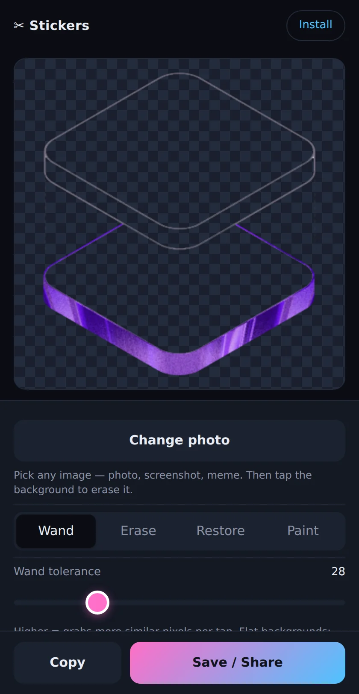

# Sticker Maker

A web app that turns a photo or a screenshot into an iOS sticker, with no App Store download and no Apple Developer account. Cut the background out of an image on your phone, save the result to Photos, and iOS lifts it into your sticker drawer.

Live at **https://jackhomer.com/polygon-stickers/**



## How the handoff to iOS works

Apple only adds a sticker to the system drawer through the user's own long-press in Photos, so the app stops one step short of that and hands off:

1. Cut the background out of your image in the app.
2. Tap Save / Share. The export flattens the cut-out onto a solid lime-green background and writes a 1024x1024 JPEG, then opens the iOS share sheet so you can save it to Photos.
3. Long-press the subject in Photos and tap Add Sticker. It then works in Messages and anywhere else stickers do.

The lime background is there on purpose. Photos strips transparency when saving a PNG out of Safari, and the subject-lift model needs a foreground sitting on a background to have anything to separate. Flat lime gives it both. On a device without the share sheet the same JPEG downloads as a file instead, and the Copy button puts it on the clipboard.

## Cutting out the subject

Four tools work on one canvas:

- Wand: flood-fills from the pixel you tap, following RGB distance out to a tolerance you set from 0 to 120, with the alpha faded rather than cut at the tolerance edge so the border does not come out jagged.
- Erase: a round brush, 6 to 200 pixels, that clears whatever it passes over.
- Restore: the same brush running backwards, painting pixels back from the image as it was loaded.
- Paint: an opaque brush in one of eight colors, for filling a hole the wand ate or drawing on the sticker.

Crop to subject trims to the bounding box of what is still opaque and re-centers it. Undo goes back ten steps and Reset returns to the original image. Auto-remove bg pulls in `@imgly/background-removal` on demand, a model of about 30 MB that the browser caches after the first run, and does the segmentation on the device.

Editing happens in a `<canvas>` on your own device. There is no server and no account.

## Installing it

Open the site in Safari and use Share, then Add to Home Screen. A manifest and a service worker make it launch full screen and keep working offline after the first load. [install.html](install.html), linked from the Install button in the app, walks through it.

## Running it locally

No build step. Serve the directory with anything static:

```sh
python3 -m http.server 8000
```

Then open http://localhost:8000/. The icons are generated with `node scripts/gen-icons.mjs`, which needs `pngjs` installed.

Pushing to `main` publishes it: GitHub Pages serves the repository root.

## Stack

Vanilla JavaScript in a single page, with no framework and no bundler. `app.js` holds the editor, `style.css` the mobile-first dark UI, and `service-worker.js` a version-keyed offline cache.

MIT licensed. More projects: https://jackhomer.com/projects/
